# CloudAI System Architecture

**Last Updated:** November 26, 2025

> **Note:** Architecture diagrams are available as PlantUML files in `docs/Diagrams/`. You can render them using any PlantUML viewer or IDE plugin. Pre-rendered PNG images are also available.

## High-Level Architecture

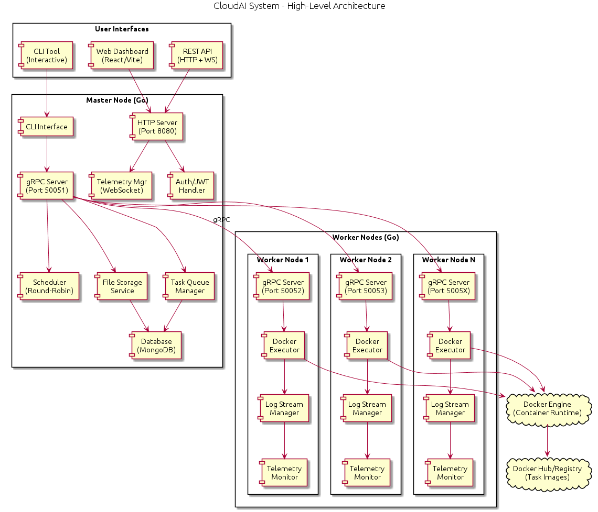

The CloudAI system follows a master-worker distributed architecture:

- **User Interfaces**: CLI Tool, Web Dashboard (React/Vite), REST API
- **Master Node (Go)**: Central coordinator handling task scheduling, worker management, and client requests
- **Worker Nodes (Go)**: Distributed execution nodes running Docker containers
- **Docker Engine**: Container runtime for task execution
- **MongoDB**: Persistent storage for tasks, workers, results, and metadata

## Component Details

### Master Node Components

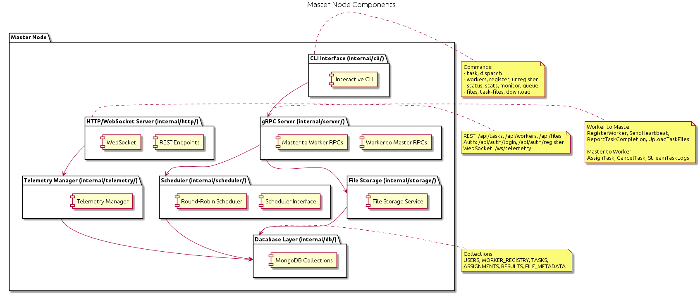

| Component | Location | Description |
|-----------|----------|-------------|
| CLI Interface | `internal/cli/` | Interactive readline-based command prompt for task submission, worker management, monitoring, and file operations |
| HTTP/WebSocket Server | `internal/http/` | REST API endpoints for tasks, workers, files, auth; WebSocket for real-time telemetry |
| gRPC Server | `internal/server/` | Worker ↔ Master communication: registration, heartbeats, task assignment, file uploads |
| Scheduler | `internal/scheduler/` | Pluggable scheduling algorithms (Round-Robin implemented) with resource-aware worker selection |
| Telemetry Manager | `internal/telemetry/` | Per-worker telemetry data, WebSocket broadcasting, real-time monitoring |
| File Storage | `internal/storage/` | Secure file storage with per-user/per-task isolation and access control |
| Database Layer | `internal/db/` | MongoDB operations for users, workers, tasks, assignments, results, file metadata |

### Worker Node Components

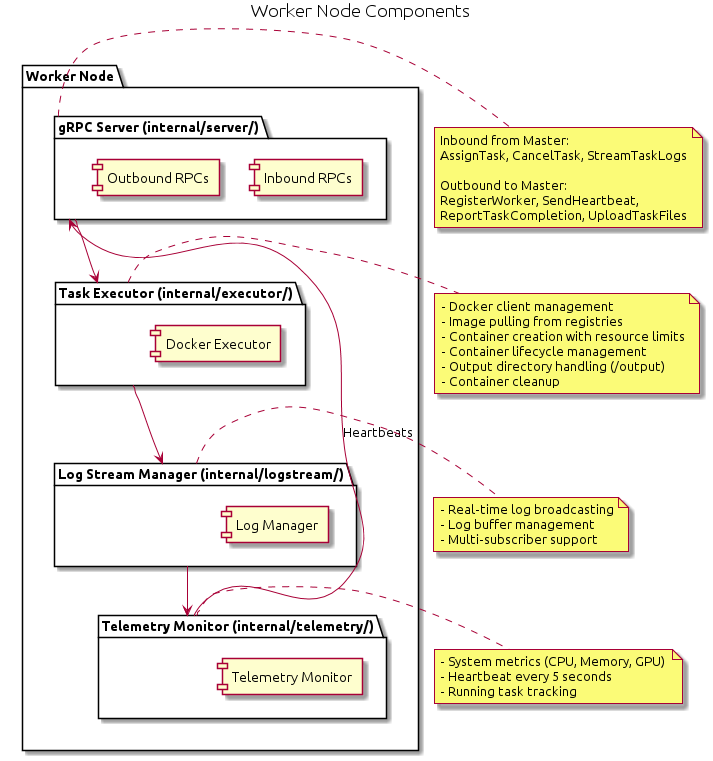

| Component | Location | Description |
|-----------|----------|-------------|
| gRPC Server | `internal/server/` | Handles task assignments, cancellations, log streaming from master |
| Task Executor | `internal/executor/` | Docker client management, image pulling, container lifecycle, resource limits |
| Log Stream Manager | `internal/logstream/` | Real-time log broadcasting, buffer management, multi-subscriber support |
| Telemetry Monitor | `internal/telemetry/` | System metrics (CPU, Memory, GPU), heartbeats (5s interval), result reporting |

### Web UI Components

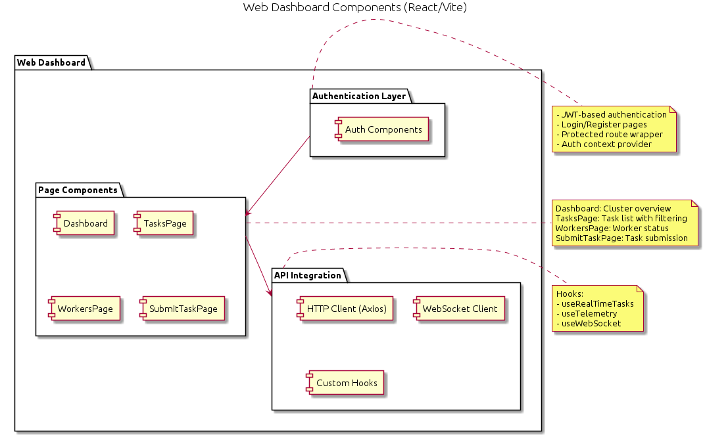

| Component | Location | Description |
|-----------|----------|-------------|
| Authentication | `src/context/`, `src/pages/auth/` | JWT-based auth, login/register pages, protected routes |
| Page Components | `src/pages/` | Dashboard, TasksPage, WorkersPage, SubmitTaskPage |
| API Integration | `src/api/`, `src/hooks/` | Axios HTTP client, WebSocket client, custom hooks |

## Communication Flow

### 1. Worker Registration

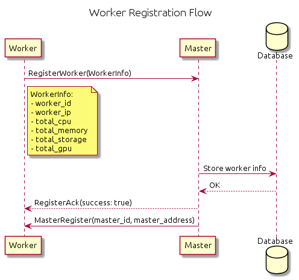

1. Worker sends `RegisterWorker()` with WorkerInfo (worker_id, worker_ip, total_cpu, total_memory, total_storage, total_gpu)
2. Master stores worker info in database and memory
3. Master responds with `RegisterAck(success: true)`
4. Master sends `MasterRegister()` to worker with master_id and master_address

### 2. Heartbeat Monitoring

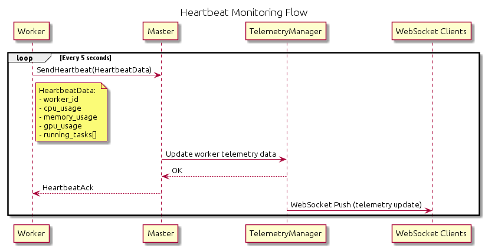

1. Worker sends `SendHeartbeat()` every 5 seconds with telemetry data (worker_id, cpu_usage, memory_usage, gpu_usage, running_tasks[])
2. Master updates TelemetryManager with worker data
3. Master responds with `HeartbeatAck`
4. TelemetryManager pushes updates to WebSocket clients

### 3. Task Assignment and Execution

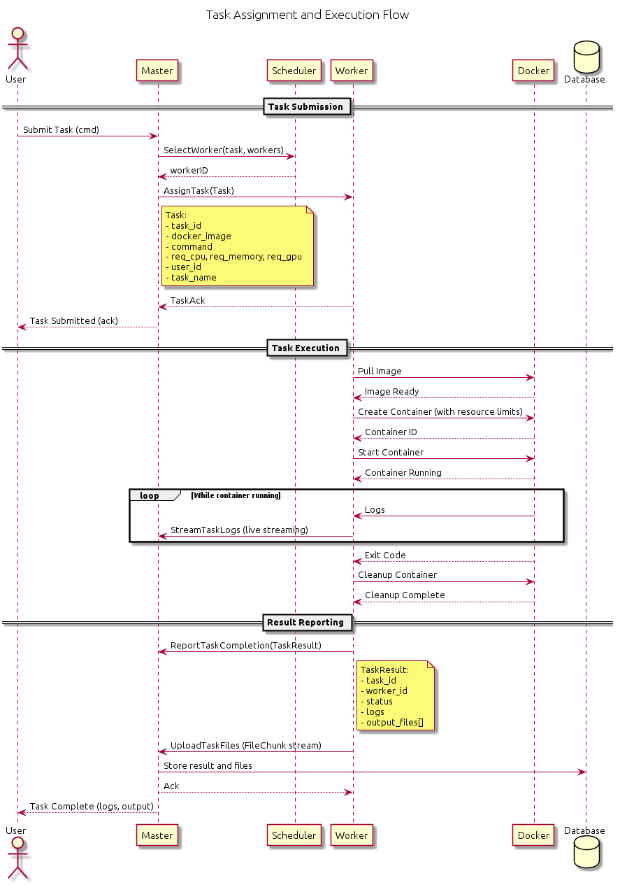

**Task Submission Phase:**
1. User submits task via CLI/REST/Web UI
2. Master's Scheduler selects appropriate worker based on resources
3. Master sends `AssignTask()` to selected worker with Task details (task_id, docker_image, command, req_cpu, req_memory, req_gpu, user_id, task_name)
4. Worker acknowledges with `TaskAck`
5. Master confirms submission to user

**Task Execution Phase:**
1. Worker pulls Docker image from registry
2. Worker creates container with resource limits
3. Worker starts container and begins execution
4. Worker streams logs to Master via `StreamTaskLogs()`
5. Container completes with exit code
6. Worker cleans up container

**Result Reporting Phase:**
1. Worker sends `ReportTaskCompletion()` with TaskResult (task_id, worker_id, status, logs, output_files[])
2. Worker uploads output files via `UploadTaskFiles()` (FileChunk stream)
3. Master stores results and files in database
4. Master acknowledges completion to worker
5. Results available to user

### 4. Task Queuing Flow

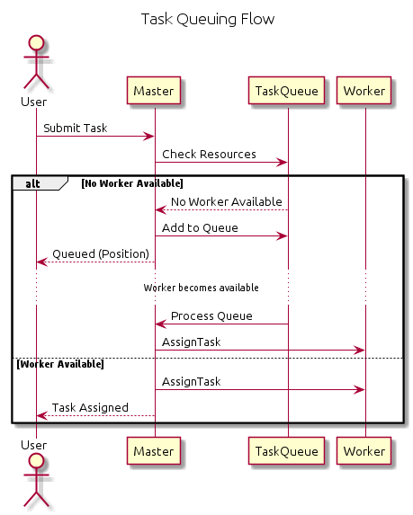

When no worker is available:
1. User submits task
2. Master checks resources via TaskQueue
3. If no worker available, task is added to queue
4. User receives queued position
5. When worker becomes available, TaskQueue triggers processing
6. Master assigns task to available worker

## Data Flow

### Task Lifecycle

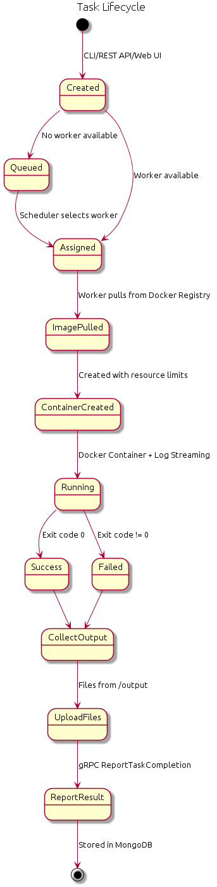

| State | Description |
|-------|-------------|
| Created | Task submitted via CLI/REST API/Web UI |
| Queued | No worker available, waiting in queue |
| Assigned | Scheduler selected worker, gRPC AssignTask sent |
| ImagePulled | Worker pulled image from Docker Registry |
| ContainerCreated | Container created with resource limits |
| Running | Docker container executing + log streaming active |
| Success/Failed | Container exited (code 0 = success, else failed) |
| CollectOutput | Files collected from /output directory |
| UploadFiles | Worker → Master via gRPC streaming |
| ReportResult | gRPC ReportTaskCompletion sent |
| Stored | Results persisted in MongoDB |

### File Storage Flow

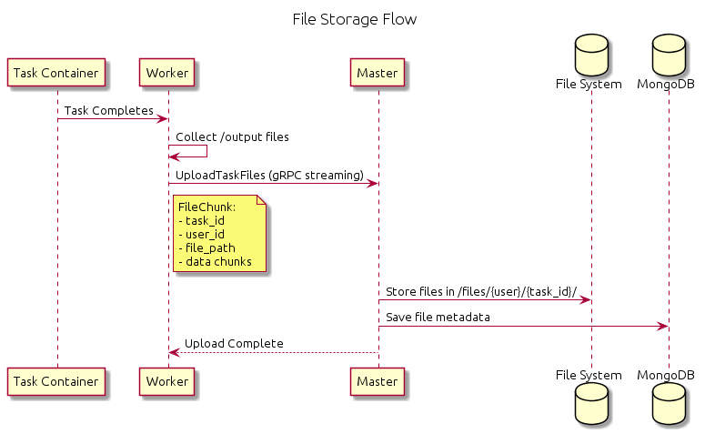

1. Task completes in container
2. Worker collects files from `/output` directory
3. Worker sends `UploadTaskFiles()` (gRPC streaming) with FileChunk (task_id, user_id, file_path, data chunks)
4. Master stores files in `/files/{user}/{task_id}/`
5. Master saves file metadata to database

## Network Architecture


### Port Assignments

| Component | Port | Description |
|-----------|------|-------------|
| Master gRPC | 0.0.0.0:50051 | Worker communication |
| Master HTTP/WS | 0.0.0.0:8080 | REST API, WebSocket, Auth |
| MongoDB | localhost:27017 | Database |
| Worker 1 gRPC | 0.0.0.0:50052 | Task execution |
| Worker 2 gRPC | 0.0.0.0:50053 | Task execution |
| Worker N gRPC | 0.0.0.0:5005N | Task execution |
| Web UI (Dev) | localhost:3000 | Vite dev server |

### REST API Endpoints

| Endpoint | Description |
|----------|-------------|
| `/api/auth/register` | User registration |
| `/api/auth/login` | User authentication |
| `/api/tasks` | Task CRUD operations |
| `/api/workers` | Worker list, details, metrics |
| `/api/files` | File list, download with access control |
| `/telemetry`, `/health` | System telemetry and health checks |
| `/ws/telemetry` | Real-time telemetry streaming |
| `/ws/telemetry/{id}` | Per-worker telemetry streaming |

### Protocol Stack

| Layer | Protocols |
|-------|-----------|
| Layer 7 (Application) | gRPC (Protobuf), HTTP/REST (JSON), WebSocket (JSON), JWT |
| Layer 4 (Transport) | HTTP/2 (gRPC), HTTP/1.1 + WebSocket Upgrade |

## Scalability Model

### Horizontal Scaling

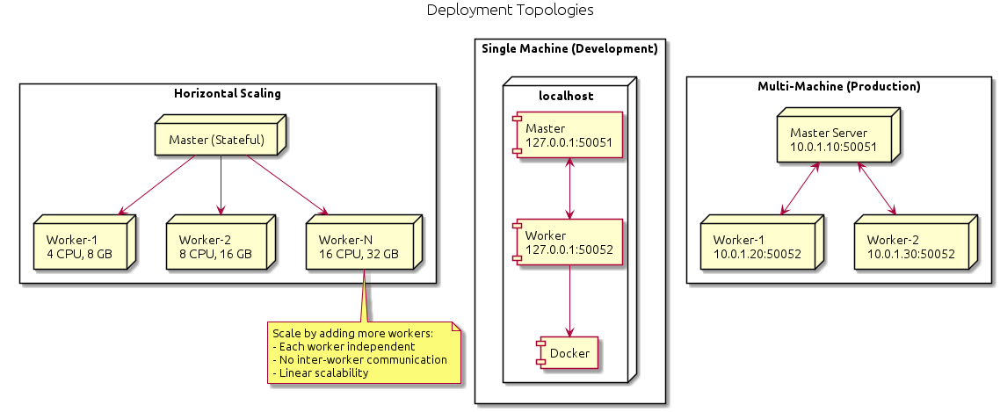

- **Master**: Stateful, single instance (coordinates all workers)
- **Workers**: Stateless, add more for increased capacity
- **Scaling**: Linear scalability by adding workers
- **Independence**: No inter-worker communication required

## Security Architecture

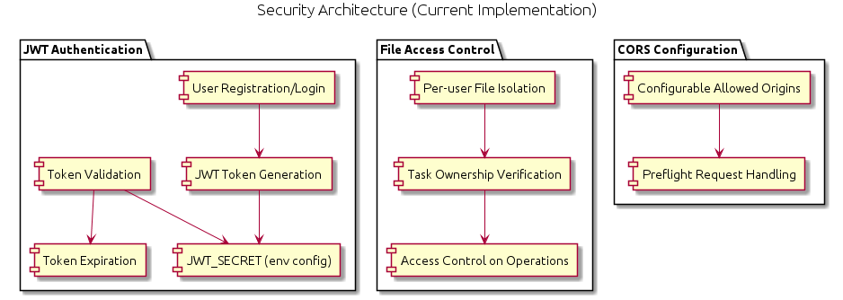

### Current Implementation

| Feature | Description |
|---------|-------------|
| JWT Authentication | User registration/login, token generation/validation, configurable JWT_SECRET, token expiration |
| File Access Control | Per-user file isolation, task ownership verification, access control on operations |
| CORS Configuration | Configurable allowed origins, preflight request handling |

## Deployment Topologies

### Single Machine (Development)

```
localhost
├── Master (127.0.0.1:50051)
├── Worker (127.0.0.1:50052)
└── Docker (/var/run/docker.sock)
```

### Multi-Machine (Production)

```
Master Server (10.0.1.10:50051)
├── Worker-1 (10.0.1.20:50052)
└── Worker-2 (10.0.1.30:50052)
```

---

## Project Directory Structure

```
CloudAI/
├── master/                          # Master Node (Go)
│   ├── main.go                      # Entry point
│   ├── go.mod                       # Go module definition
│   ├── go.sum                       # Go dependencies checksum
│   ├── .env                         # Environment variables
│   ├── .env.example                 # Environment template
│   └── internal/
│       ├── cli/
│       │   └── cli.go               # Interactive CLI
│       ├── config/
│       │   └── config.go            # Configuration management
│       ├── db/
│       │   ├── init.go              # Database initialization
│       │   ├── tasks.go             # Task CRUD operations
│       │   ├── tasks_test.go        # Task tests
│       │   ├── workers.go           # Worker registry
│       │   ├── assignments.go       # Task-worker assignments
│       │   ├── results.go           # Task execution results
│       │   ├── users.go             # User management
│       │   └── file_metadata.go     # File metadata tracking
│       ├── http/
│       │   ├── task_handler.go      # Task REST API
│       │   ├── worker_handler.go    # Worker REST API
│       │   ├── file_handler.go      # File REST API
│       │   ├── auth_handler.go      # JWT authentication
│       │   ├── middleware.go        # CORS, auth middleware
│       │   └── telemetry_server.go  # WebSocket telemetry
│       ├── scheduler/
│       │   ├── scheduler.go         # Scheduler interface
│       │   └── round_robin.go       # Round-robin implementation
│       ├── server/
│       │   ├── master_server.go     # gRPC server logic
│       │   └── log_streaming_helper.go
│       ├── storage/
│       │   ├── file_storage.go      # File operations
│       │   ├── file_storage_secure.go
│       │   ├── access_control.go    # File access control
│       │   └── access_control_test.go
│       ├── system/
│       │   └── system.go            # System utilities
│       └── telemetry/
│           └── telemetry_manager.go # Telemetry management
│
├── worker/                          # Worker Node (Go)
│   ├── main.go                      # Entry point
│   ├── go.mod                       # Go module definition
│   ├── go.sum                       # Go dependencies checksum
│   └── internal/
│       ├── executor/
│       │   └── executor.go          # Docker task executor
│       ├── logstream/
│       │   ├── log_manager.go       # Log management
│       │   └── log_broadcaster.go   # Multi-client broadcast
│       ├── server/
│       │   └── worker_server.go     # gRPC server
│       ├── system/
│       │   └── system.go            # System metrics
│       └── telemetry/
│           └── telemetry.go         # Heartbeat & telemetry
│
├── proto/                           # Protocol Buffers
│   ├── master_worker.proto          # Master ↔ Worker communication
│   ├── master_agent.proto           # Master ↔ Agent communication
│   ├── generate.sh                  # Code generation script
│   ├── pb/                          # Generated Go code
│   │   ├── master_worker.pb.go
│   │   ├── master_worker_grpc.pb.go
│   │   ├── master_agent.pb.go
│   │   └── master_agent_grpc.pb.go
│   └── py/                          # Generated Python code
│       ├── __init__.py
│       ├── master_agent_pb2.py
│       └── master_agent_pb2_grpc.py
│
├── ui/                              # Web Dashboard (React/Vite)
│   ├── index.html                   # HTML entry point
│   ├── package.json                 # npm dependencies
│   ├── package-lock.json            # npm lock file
│   ├── vite.config.js               # Vite configuration
│   └── src/
│       ├── main.jsx                 # React entry point
│       ├── App.jsx                  # Root component
│       ├── api/
│       │   ├── client.js            # Axios HTTP client
│       │   ├── auth.js              # Auth API calls
│       │   ├── tasks.js             # Task API calls
│       │   ├── workers.js           # Worker API calls
│       │   └── websocket.js         # WebSocket client
│       ├── components/
│       │   ├── WorkerRegistrationDialog.jsx
│       │   ├── auth/
│       │   │   └── ProtectedRoute.jsx
│       │   ├── layout/
│       │   │   ├── Navbar.jsx
│       │   │   └── Sidebar.jsx
│       │   └── tasks/
│       │       ├── SubmitTask.jsx
│       │       └── TaskLogsDialog.jsx
│       ├── context/
│       │   └── AuthContext.jsx      # Auth state management
│       ├── hooks/
│       │   ├── useRealTimeTasks.js
│       │   ├── useTelemetry.js
│       │   └── useWebSocket.js
│       ├── pages/
│       │   ├── Dashboard.jsx
│       │   ├── TasksPage.jsx
│       │   ├── WorkersPage.jsx
│       │   ├── SubmitTaskPage.jsx
│       │   └── auth/
│       │       ├── LoginPage.jsx
│       │       └── RegisterPage.jsx
│       ├── styles/
│       │   └── global.css
│       └── utils/
│           ├── constants.js
│           └── formatters.js
│
├── database/                        # Database Setup
│   ├── docker-compose.yml           # MongoDB container
│   └── README.md
│
├── docs/                            # Documentation
│   ├── ARCHITECTURE.md              # This file
│   ├── DOCUMENTATION.md             # Complete reference
│   ├── GETTING_STARTED.md           # Quick start guide
│   ├── EXAMPLE.md                   # Usage examples
│   └── Diagrams/                    # PlantUML diagrams
│       ├── high-level-architecture.puml
│       ├── high-level-architecture.png
│       ├── master-node.puml
│       ├── master-node.png
│       ├── worker-node.puml
│       ├── worker-node.png
│       ├── web-ui.puml
│       ├── web-ui.png
│       ├── worker-registration.puml
│       ├── worker-registration.png
│       ├── heartbeat.puml
│       ├── heartbeat.png
│       ├── task-execution.puml
│       ├── task-execution.png
│       ├── task-queuing.puml
│       ├── task-queuing.png
│       ├── task-lifecycle.puml
│       ├── task-lifecycle.png
│       ├── file-storage.puml
│       ├── file-storage.png
│       ├── network.puml
│       ├── network.png
│       ├── deployment.puml
│       ├── deployment.png
│       ├── security.puml
│       └── security.png
│
├── Makefile                         # Build automation
├── README.md                        # Project README
├── requirements.txt                 # Python dependencies
├── runMaster.sh                     # Master startup script
└── runWorker.sh                     # Worker startup script
```

---

## Architecture Capabilities

This architecture supports:

- **Horizontal Scaling**: Add more workers for increased capacity
- **Fault Tolerance**: Worker failures handled gracefully with task re-queuing
- **Real-time Monitoring**: Heartbeat system + WebSocket telemetry
- **Flexible Deployment**: Local development to cloud production
- **Authentication**: JWT-based user authentication
- **File Management**: Secure per-user/per-task file upload/download
- **Task Queuing**: Automatic queuing when no workers available
- **Web Dashboard**: React-based UI for monitoring and management
