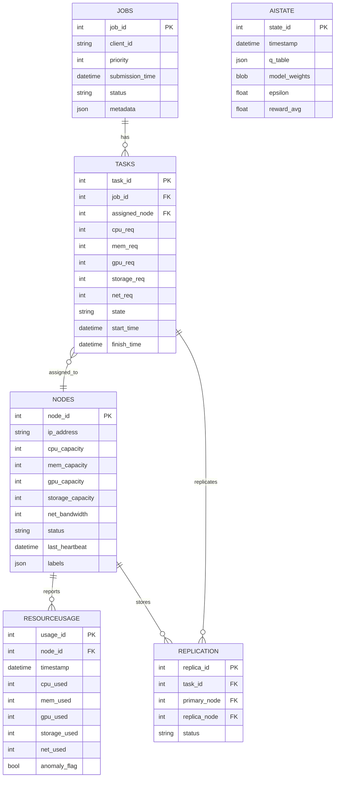

* richer **resource dimensions** (CPU, GPU, memory, storage, network),
* flexibility for both **monolithic and parallel jobs**,
* explicit **task derivation** from jobs.

---
# Updated Schema Design
## 1. **Node Schema**

Tracks worker nodes, their capabilities, and health.

```sql
CREATE TABLE Nodes (
    node_id           INTEGER PRIMARY KEY,
    ip_address        TEXT NOT NULL,
    port              INTEGER NOT NULL,
    cpu_capacity      INTEGER NOT NULL,    -- in millicores
    mem_capacity      INTEGER NOT NULL,    -- in MB
    gpu_capacity      INTEGER DEFAULT 0,   -- number of GPUs
    storage_capacity  INTEGER,             -- in MB
    net_bandwidth     INTEGER,             -- in Mbps
    status            TEXT CHECK(status IN ('Healthy', 'Unreachable', 'Degraded')),
    last_heartbeat    TIMESTAMP NOT NULL,
    labels            JSON,                -- key-value labels (e.g., zone, GPU type)
    created_at        TIMESTAMP DEFAULT CURRENT_TIMESTAMP
);
```

* **Purpose:**

  * Represents cluster nodes with full resource profiles.
  * Supports heterogeneous nodes (CPU-only, GPU-rich, high-storage, etc.).
  * Feeds into scheduling decisions.

| Column            | Type      | Description                                          |
| ----------------- | --------- | ---------------------------------------------------- |
| node\_id (PK)     | INTEGER   | Unique identifier for each worker node.              |
| ip\_address       | TEXT      | Node’s IP address for communication.                 |
| port              | INTEGER   | Port number where worker listens.                    |
| cpu\_capacity     | INTEGER   | Total CPU available (in millicores).                 |
| mem\_capacity     | INTEGER   | Total memory available (MB).                         |
| gpu\_capacity     | INTEGER   | Number of GPUs available.                            |
| storage\_capacity | INTEGER   | Total disk/storage capacity (MB).                    |
| net\_bandwidth    | INTEGER   | Max network bandwidth (Mbps).                        |
| status            | TEXT      | Node state: `Healthy`, `Unreachable`, `Degraded`.    |
| last\_heartbeat   | TIMESTAMP | Last heartbeat timestamp.                            |
| labels            | JSON      | Arbitrary key-value metadata (e.g., zone, GPU type). |
| created\_at       | TIMESTAMP | When node was registered.                            |

---
## 2. **Job Schema**

Jobs are high-level workloads submitted by clients.

```sql
CREATE TABLE Jobs (
    job_id            INTEGER PRIMARY KEY AUTOINCREMENT,
    client_id         TEXT NOT NULL,
    priority          INTEGER DEFAULT 1,
    submission_time   TIMESTAMP DEFAULT CURRENT_TIMESTAMP,
    status            TEXT CHECK(status IN ('Pending', 'Running', 'Completed', 'Failed')),
    metadata          JSON                 -- describes job type, parameters, and how to derive tasks
);
```

* **Purpose:**

  * Represents a unit of client work (may or may not be parallelizable).
  * `metadata` describes job-specific details (e.g., `"type": "wordcount", "files": [...]`).

| Column           | Type      | Description                                                  |
| ---------------- | --------- | ------------------------------------------------------------ |
| job\_id (PK)     | INTEGER   | Unique identifier for a job.                                 |
| client\_id       | TEXT      | ID of the client submitting the job.                         |
| priority         | INTEGER   | Scheduling priority (higher = more urgent).                  |
| submission\_time | TIMESTAMP | When job was submitted.                                      |
| status           | TEXT      | Current status: `Pending`, `Running`, `Completed`, `Failed`. |
| metadata         | JSON      | Job-specific parameters (e.g., files, epochs, type).         |


---
## 3. **Task Schema**

Atomic units of work derived from a job.

```sql
CREATE TABLE Tasks (
    task_id           INTEGER PRIMARY KEY AUTOINCREMENT,
    job_id            INTEGER NOT NULL REFERENCES Jobs(job_id),
    assigned_node     INTEGER REFERENCES Nodes(node_id),
    cpu_req           INTEGER NOT NULL,   -- in millicores
    mem_req           INTEGER NOT NULL,   -- in MB
    gpu_req           INTEGER DEFAULT 0,  -- GPUs required
    storage_req       INTEGER DEFAULT 0,  -- MB
    net_req           INTEGER DEFAULT 0,  -- Mbps
    state             TEXT CHECK(state IN ('Queued', 'Assigned', 'Running', 'Completed', 'Failed', 'Reassigned')),
    start_time        TIMESTAMP,
    finish_time       TIMESTAMP,
    retries           INTEGER DEFAULT 0,
    max_retries       INTEGER DEFAULT 3,
    latency_ms        INTEGER,
    logs_path         TEXT
);
```

* **Purpose:**

  * Defines executable units with explicit resource requirements.
  * Allows both monolithic (1 task) and distributed (N tasks) jobs.

| Column              | Type      | Description                                            |
| ------------------- | --------- | ------------------------------------------------------ |
| task\_id (PK)       | INTEGER   | Unique identifier for each task.                       |
| job\_id (FK)        | INTEGER   | Parent job reference.                                  |
| assigned\_node (FK) | INTEGER   | Node executing the task.                               |
| cpu\_req            | INTEGER   | CPU requested (millicores).                            |
| mem\_req            | INTEGER   | Memory requested (MB).                                 |
| gpu\_req            | INTEGER   | Number of GPUs requested.                              |
| storage\_req        | INTEGER   | Storage required (MB).                                 |
| net\_req            | INTEGER   | Network bandwidth required (Mbps).                     |
| state               | TEXT      | Task lifecycle: `Queued`, `Running`, `Completed`, etc. |
| start\_time         | TIMESTAMP | When task execution started.                           |
| finish\_time        | TIMESTAMP | When task finished.                                    |
| retries             | INTEGER   | How many times this task retried.                      |
| max\_retries        | INTEGER   | Max retries allowed.                                   |
| latency\_ms         | INTEGER   | Task completion latency (ms).                          |
| logs\_path          | TEXT      | Path to logs or output files.                          |


---
## 4. **Resource Usage Schema**

Periodic reports from worker nodes.

```sql
CREATE TABLE ResourceUsage (
    usage_id          INTEGER PRIMARY KEY AUTOINCREMENT,
    node_id           INTEGER NOT NULL REFERENCES Nodes(node_id),
    timestamp         TIMESTAMP DEFAULT CURRENT_TIMESTAMP,
    cpu_used          INTEGER,   -- in millicores
    mem_used          INTEGER,   -- in MB
    gpu_used          INTEGER,   -- GPUs
    storage_used      INTEGER,   -- MB
    net_used          INTEGER,   -- Mbps
    anomaly_flag      BOOLEAN DEFAULT 0
);
```

* **Purpose:**

  * Provides real-time telemetry for each node.
  * Feeds into the **Resource Monitor** and AI scheduler state.

| Column         | Type      | Description                               |
| -------------- | --------- | ----------------------------------------- |
| usage\_id (PK) | INTEGER   | Unique identifier for usage report.       |
| node\_id (FK)  | INTEGER   | Node reporting the usage.                 |
| timestamp      | TIMESTAMP | Time of resource measurement.             |
| cpu\_used      | INTEGER   | CPU currently used (millicores).          |
| mem\_used      | INTEGER   | Memory used (MB).                         |
| gpu\_used      | INTEGER   | GPUs in use.                              |
| storage\_used  | INTEGER   | Storage used (MB).                        |
| net\_used      | INTEGER   | Network bandwidth used (Mbps).            |
| anomaly\_flag  | BOOLEAN   | `1` if anomaly detected (e.g., overload). |


---
## 5. **Replication Metadata Schema**

Manages redundancy of task data across nodes.

```sql
CREATE TABLE Replication (
    replica_id        INTEGER PRIMARY KEY AUTOINCREMENT,
    task_id           INTEGER NOT NULL REFERENCES Tasks(task_id),
    primary_node      INTEGER NOT NULL REFERENCES Nodes(node_id),
    replica_node      INTEGER NOT NULL REFERENCES Nodes(node_id),
    status            TEXT CHECK(status IN ('Active', 'OutOfSync', 'Failed'))
);
```

* **Purpose:**

  * Ensures redundancy of task data and checkpoints.
  * Enables recovery when a primary node fails.

| Column             | Type    | Description                                      |
| ------------------ | ------- | ------------------------------------------------ |
| replica\_id (PK)   | INTEGER | Unique replica record.                           |
| task\_id (FK)      | INTEGER | Task being replicated.                           |
| primary\_node (FK) | INTEGER | Original node holding data.                      |
| replica\_node (FK) | INTEGER | Node storing replica.                            |
| status             | TEXT    | Replica status: `Active`, `OutOfSync`, `Failed`. |


---
## 6. **AI Model State Schema**

Tracks reinforcement learning parameters.

```sql
CREATE TABLE AIState (
    state_id          INTEGER PRIMARY KEY AUTOINCREMENT,
    timestamp         TIMESTAMP DEFAULT CURRENT_TIMESTAMP,
    q_table           JSON,      -- if using Q-learning
    model_weights     BLOB,      -- if using DQN
    epsilon           REAL,      -- exploration rate
    reward_avg        REAL       -- rolling average of rewards
);
```

* **Purpose:**

  * Stores model progress, exploration settings, and reward feedback.
  * Supports resuming, retraining, and debugging.

| Column         | Type      | Description                          |
| -------------- | --------- | ------------------------------------ |
| state\_id (PK) | INTEGER   | Unique state checkpoint.             |
| timestamp      | TIMESTAMP | When state was saved.                |
| q\_table       | JSON      | Q-learning state-action values.      |
| model\_weights | BLOB      | Serialized weights for DQN.          |
| epsilon        | REAL      | Exploration rate (0–1).              |
| reward\_avg    | REAL      | Rolling average of observed rewards. |


---
# Workflow Recap

1. **Nodes** register with full resource capacities.
2. **Client submits Job** → entry in `Jobs`.
3. **Derive Tasks**: job metadata processed into one or more `Tasks` with explicit resource requirements.

   * Monolithic job → 1 task.
   * Parallelizable job → multiple tasks.
4. **Scheduler (AI)** consults `Nodes` + `ResourceUsage` → assigns tasks.
5. **Workers execute Tasks** and update state/latency.
6. **Replication Agent** maintains redundancy (`Replication`).
7. **Fault Detector** marks nodes unhealthy, reassigns tasks.
8. **AI Model** updates Q-table/weights using `AIState`.

---
# **ER diagram (Entity-Relationship)** for this schema


---
