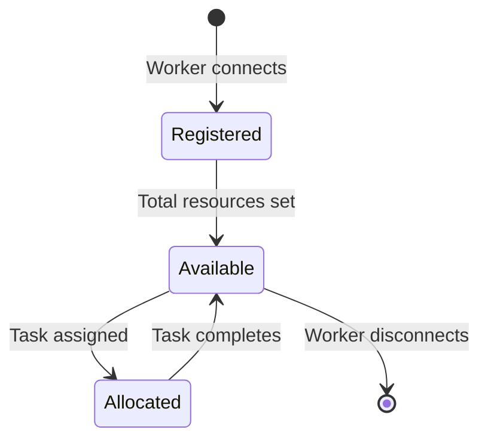

# Resource Tracking Quick Reference

## How It Works

### Resource States
- **Total**: Maximum resources available on worker
- **Allocated**: Resources currently assigned to running tasks  
- **Available**: Resources free for new tasks (Total - Allocated)

### Formula
```
Available = Total - Allocated
```

## Resource Checks

### When Assigning Tasks
The master checks **before** assigning:
```go
if worker.AvailableCPU < task.ReqCpu {
    // Reject task - insufficient resources
}
```

### What Happens
1. **Task Assignment** → Resources allocated
2. **Task Completion** → Resources released
3. **Worker Down** → Resources remain allocated until tasks complete

## CLI Commands

### View All Workers
```bash
master> list
```
Shows: Total / Allocated / Available for each resource

### View Single Worker Details  
```bash
master> stats worker-1
```
Shows:
- Total / Allocated / Available resources
- Utilization percentages
- Real-time usage from heartbeats
- Running task count

## Example Scenarios

### Scenario 1: Fresh Worker
```
Worker: 8 CPU, 16 GB Memory
Allocated: 0 CPU, 0 GB
Available: 8 CPU, 16 GB
Status: ✓ Can accept tasks
```

### Scenario 2: Partially Loaded
```
Worker: 8 CPU, 16 GB Memory
Task-1: 2 CPU, 4 GB (running)
Task-2: 2 CPU, 4 GB (running)
---
Allocated: 4 CPU, 8 GB
Available: 4 CPU, 8 GB
Status: ✓ Can accept more tasks
```

### Scenario 3: Fully Loaded
```
Worker: 8 CPU, 16 GB Memory  
Task-1: 4 CPU, 8 GB (running)
Task-2: 4 CPU, 8 GB (running)
---
Allocated: 8 CPU, 16 GB
Available: 0 CPU, 0 GB
Status: ❌ Cannot accept tasks
```

### Scenario 4: Oversubscription Prevented
```
Worker Available: 2 CPU
New Task Request: 3 CPU
Result: ❌ "Insufficient CPU: worker has 2.00 available, task requires 3.00"
```

## Resource Lifecycle



## Testing Resource Tracking

### Test 1: Basic Assignment
```bash
# Start with fresh worker (8 CPU, 16 GB)
master> list
# Verify: Available = 8 CPU, 16 GB

master> assign worker-1 ubuntu:22.04
# Task uses: 1 CPU, 1 GB (default)

master> list  
# Verify: Allocated = 1 CPU, 1 GB
#         Available = 7 CPU, 15 GB
```

### Test 2: Oversubscription
```bash
# Worker has: 2 CPU available
master> assign worker-1 ubuntu:22.04
# Assign with: 3 CPU requirement
# Expected: ❌ Insufficient CPU error
```

### Test 3: Resource Release
```bash
# After task completes (success or failure)
master> list
# Verify: Resources released back to available pool
```

## Debugging

### Check Worker Resources
```bash
master> stats worker-1
```
Look for:
- Allocated vs Available mismatch
- Overallocation (Allocated > Total) - shouldn't happen
- Available < 0 - shouldn't happen

### Check Database
The MongoDB `WORKER_REGISTRY` collection contains:
```json
{
  "worker_id": "worker-1",
  "total_cpu": 8.0,
  "allocated_cpu": 2.0,
  "available_cpu": 6.0,
  ...
}
```

## Key Points

✅ **Automatic**: Resources tracked automatically, no manual intervention
✅ **Persistent**: State survives master restarts (stored in database)
✅ **Accurate**: Both in-memory and database kept in sync
✅ **Safe**: Prevents oversubscription with pre-assignment checks
✅ **Visible**: CLI shows clear resource status

## Error Messages

### Insufficient Resources
```
Insufficient CPU: worker has 2.00 available, task requires 3.00
Insufficient Memory: worker has 4.00 GB available, task requires 8.00 GB
Insufficient Storage: worker has 50.00 GB available, task requires 100.00 GB
Insufficient GPU: worker has 0.00 available, task requires 1.00
```

### Resolution
- Wait for tasks to complete (resources will be released)
- Assign task to different worker with more resources
- Scale up worker resources (add more CPU/memory)

## Implementation Details

### Files Modified
- `master/internal/db/workers.go` - DB schema + AllocateResources/ReleaseResources
- `master/internal/server/master_server.go` - Core tracking logic
- `master/internal/cli/cli.go` - Display updates

### Database Operations
- `AllocateResources()` - Atomic increment using MongoDB `$inc`
- `ReleaseResources()` - Atomic decrement using MongoDB `$inc`

### Thread Safety
- In-memory state protected by `sync.RWMutex`
- Database operations are atomic
- Resource checks happen inside locked section
