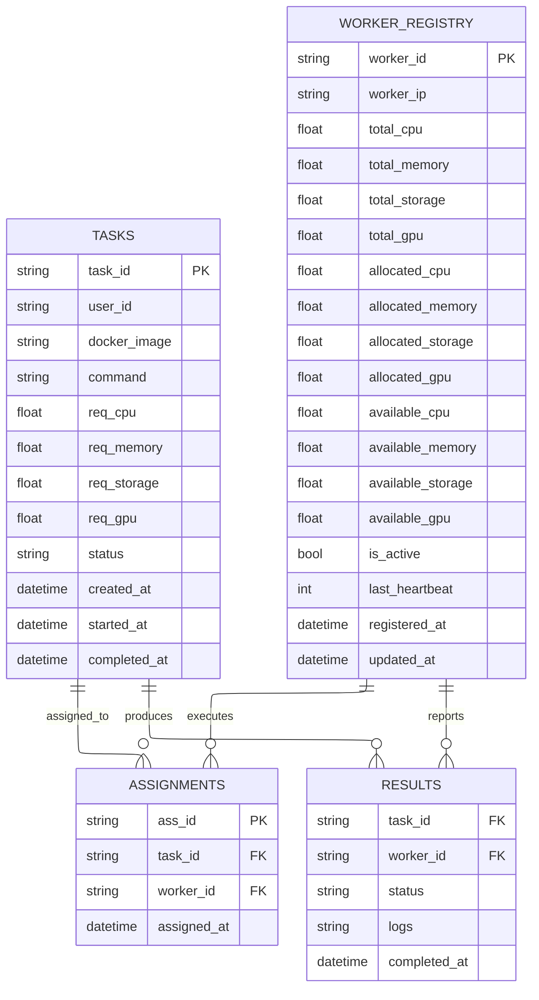

# CloudAI Database Schema

## Overview

CloudAI uses MongoDB as its primary database with the following collections:

## 📊 Database Collections

### 1. TASKS Collection
```javascript
{
  "_id": ObjectId,
  "task_id": "task-1234567890",     // Primary key
  "user_id": "user-123",            // User who submitted task
  "docker_image": "docker.io/user/image:latest", // Docker image to run
  "command": "echo hello world",    // Command to execute (optional)
  "req_cpu": 2.0,                   // Required CPU cores
  "req_memory": 4.0,                // Required memory in GB
  "req_storage": 10.0,              // Required storage in GB
  "req_gpu": 1.0,                   // Required GPU cores
  "status": "running",              // Status: pending, queued, running, completed, failed, cancelled
  "created_at": ISODate("2025-11-16T10:30:00Z"),
  "started_at": ISODate("2025-11-16T10:30:05Z"),    // Optional
  "completed_at": ISODate("2025-11-16T10:32:15Z")  // Optional
}
```

### 2. WORKER_REGISTRY Collection
```javascript
{
  "_id": ObjectId,
  "worker_id": "worker-1",           // Primary key
  "worker_ip": "192.168.1.100:50052", // Worker address
  "total_cpu": 8.0,                  // Total CPU cores
  "total_memory": 16.0,              // Total memory in GB
  "total_storage": 100.0,            // Total storage in GB
  "total_gpu": 2.0,                  // Total GPU cores
  // Resource allocation tracking
  "allocated_cpu": 2.0,              // Currently allocated CPU
  "allocated_memory": 4.0,           // Currently allocated memory
  "allocated_storage": 20.0,         // Currently allocated storage
  "allocated_gpu": 1.0,              // Currently allocated GPU
  "available_cpu": 6.0,              // Available CPU (total - allocated)
  "available_memory": 12.0,          // Available memory
  "available_storage": 80.0,         // Available storage
  "available_gpu": 1.0,              // Available GPU
  "is_active": true,                 // Worker online status
  "last_heartbeat": 1731753000,      // Unix timestamp
  "registered_at": ISODate("2025-11-16T09:00:00Z"),
  "updated_at": ISODate("2025-11-16T10:30:00Z")
}
```

### 3. ASSIGNMENTS Collection
```javascript
{
  "_id": ObjectId,
  "ass_id": "ass-1234567890",        // Primary key
  "task_id": "task-1234567890",      // Foreign key to TASKS
  "worker_id": "worker-1",           // Foreign key to WORKER_REGISTRY
  "assigned_at": ISODate("2025-11-16T10:30:05Z")
}
```

### 4. RESULTS Collection
```javascript
{
  "_id": ObjectId,
  "task_id": "task-1234567890",      // Foreign key to TASKS
  "worker_id": "worker-1",           // Foreign key to WORKER_REGISTRY
  "status": "success",               // "success", "failed", "cancelled"
  "logs": "Hello World\\nTask completed successfully\\n",
  "completed_at": ISODate("2025-11-16T10:32:15Z")
}
```

## 🔗 Entity Relationships



## 📈 Database Indexes

### Recommended Indexes for Performance

```javascript
// TASKS collection
db.TASKS.createIndex({ "task_id": 1 }, { unique: true })
db.TASKS.createIndex({ "status": 1 })
db.TASKS.createIndex({ "created_at": -1 })

// WORKER_REGISTRY collection
db.WORKER_REGISTRY.createIndex({ "worker_id": 1 }, { unique: true })
db.WORKER_REGISTRY.createIndex({ "is_active": 1 })
db.WORKER_REGISTRY.createIndex({ "last_heartbeat": -1 })

// ASSIGNMENTS collection
db.ASSIGNMENTS.createIndex({ "ass_id": 1 }, { unique: true })
db.ASSIGNMENTS.createIndex({ "task_id": 1 })
db.ASSIGNMENTS.createIndex({ "worker_id": 1 })

// RESULTS collection
db.RESULTS.createIndex({ "task_id": 1 }, { unique: true })
db.RESULTS.createIndex({ "worker_id": 1 })
```

## 🔄 Data Flow

1. **Task Submission**: Task inserted into TASKS with status "queued"
2. **Task Assignment**: Assignment created in ASSIGNMENTS, task status → "running"
3. **Resource Allocation**: WORKER_REGISTRY updated with allocated resources
4. **Task Completion**: Result inserted into RESULTS, task status → "completed"/"failed"
5. **Resource Release**: WORKER_REGISTRY updated to release allocated resources

## 🛡️ Data Consistency

- **Atomic Operations**: Resource allocation/deallocation uses MongoDB `$inc` for atomicity
- **Foreign Keys**: Logical relationships maintained through application code
- **Status Tracking**: Task lifecycle tracked through status field updates
- **Cleanup**: Failed/stale tasks handled by reconciliation process

---

**Schema Version**: 1.0  
**Last Updated**: November 16, 2025  
**Database**: MongoDB 7.0+
```