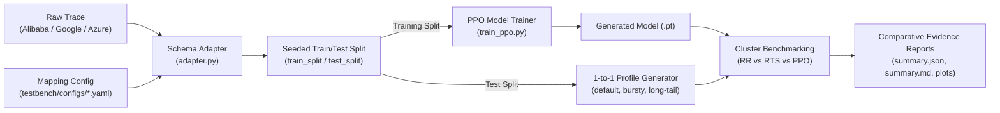

# Production Cloud Cluster Datasets Audit & Selection Guide

This document provides a comprehensive audit of production cloud cluster traces and benchmark datasets in distributed systems research, evaluating their applicability for the **Agentic Cloud Cluster** reinforcement learning scheduler, real-time scheduler, and fault resilience testbench.

---

## 1. Executive Summary & Comparison

| Dataset | Provider / Authors | Scale & Duration | Primary Workload Characteristics | Target Use Case in Agentic Cloud Cluster | Pre-configured Mapping |
| :--- | :--- | :--- | :--- | :--- | :--- |
| **Alibaba Cluster Trace v2018 / v2021** | Alibaba Cloud (ACM SoCC / OSDI) | ~4,000 nodes, 8 days, millions of tasks | Co-located latency-critical microservices and batch DAG jobs | **Primary PPO RL Model Pre-training & Multi-Dimensional Bin-Packing** | [`testbench/configs/alibaba_mapping.yaml`](../testbench/configs/alibaba_mapping.yaml) |
| **Google ClusterData 2019 (v3)** | Google LLC (EuroSys '20) | 8 Borg cells, 1 month, ~12.5k nodes | Production containerized Borg tasks with strict priority tiers | **SLA Attainment Benchmark & Real-Time Scheduler (RTS) Stress Testing** | [`testbench/configs/google_mapping.yaml`](../testbench/configs/google_mapping.yaml) |
| **Microsoft Azure Public Dataset** | Microsoft Azure (ATC '20) | Multi-week, millions of invocations | Severely bursty serverless functions and VM packing requests | **Bursty Load Surges & Tail Latency Risk Mitigation** | [`testbench/configs/default_mapping.yaml`](../testbench/configs/default_mapping.yaml) |
| **Two Sigma Flotilla Trace** | Two Sigma Investments | High-throughput quant compute | Extreme compute-heavy batch tasks with Pareto runtime distribution | **Long-Tail Head-of-Line Blocking Evaluation** | [`testbench/configs/default_mapping.yaml`](../testbench/configs/default_mapping.yaml) |

---

## 2. In-Depth Dataset Audits

### A. Alibaba Cluster Trace (`cluster-trace-v2018` & `v2021`)
- **Official Repository**: [https://github.com/alibaba/clusterdata](https://github.com/alibaba/clusterdata)
- **Data Format**: CSV (`batch_task.csv`, `batch_instance.csv`, `container_usage.csv`)
- **Key Fields**: `task_name`, `instance_num`, `job_name`, `task_type`, `status`, `start_time`, `end_time`, `plan_cpu`, `plan_mem`, `plan_gpu`

#### Rationale for Selection:
1. **5-Dimensional Feature Alignment**: Alibaba's normalized `plan_cpu` and `plan_mem` directly map to the 5-dimensional state representation ($CPU, RAM, Storage, Duration, SLA$) used by our PyTorch PPO Actor-Critic neural network.
2. **Co-located Workload Dynamics**: Captures the delicate resource contention when CPU-intensive batch jobs share worker machines with memory-intensive online services.
3. **Established Project Weights**: Our bootstrap weights (`agentic_scheduler/models/ppo_alibaba_bootstrap*.pt`) are trained on this schema.

---

### B. Google ClusterData 2019 (Borg Traces Version 3)
- **Official Repository**: [https://github.com/google/cluster-data](https://github.com/google/cluster-data)
- **Data Format**: CSV / Parquet (`collection_events`, `task_events`, `instance_usage`)
- **Key Fields**: `collection_id`, `priority`, `resource_request_cpu`, `resource_request_memory`, `runtime`, `start_time`, `end_time`

#### Rationale for Selection:
1. **Academic Gold Standard**: The most widely cited benchmark dataset in cloud computing literature (EuroSys, OSDI, NSDI, SIGCOMM).
2. **Resource Requests vs Realized Consumption**: Tracks both requested resource quotas and actual utilization, validating the scheduler's ability to maximize machine packing density without triggering Out-Of-Memory (OOM) kills.
3. **Priority & Preemption Tiers**: Maps seamlessly to our SLA multiplier ($\text{deadline} = \text{duration} \times \text{sla\_multiplier}$) to test SLA breach penalties.

---

### C. Microsoft Azure Public Dataset (Azure Functions & VM Traces)
- **Official Repository**: [https://github.com/Azure/AzurePublicDataset](https://github.com/Azure/AzurePublicDataset)
- **Data Format**: CSV (`azurefunctions-dataset2019.tar.xz`, `azurevm-dataset2019.tar.xz`)
- **Key Fields**: `app_id`, `function_name`, `trigger_type`, `duration_ms`, `invocations_per_minute`

#### Rationale for Selection:
1. **Burst Spike Profiling**: Serverless invocations display dramatic load surges (>100x baseline within seconds), providing realistic trace data for the **`bursty`** test profile (`testbench/engine/generator.py`).
2. **Serverless Concurrency**: Stresses the master node's task queue processor under extreme arrival concurrency.

---

### D. Two Sigma Flotilla Trace
- **Official Repository**: [https://github.com/twosigma/flotilla-trace](https://github.com/twosigma/flotilla-trace)
- **Data Format**: JSON / CSV
- **Key Fields**: `task_id`, `cpu_cores`, `memory_gb`, `exec_duration_sec`, `submit_time`

#### Rationale for Selection:
1. **Pareto Long-Tail Distributions**: 90% of jobs complete in under 5 seconds, while 1% consume massive compute resources for hours.
2. **Head-of-Line Blocking**: Directly exercises our **`long-tail`** test profile to ensure that short latency-sensitive tasks are not starved by worker saturation.

---

## 3. Dataset Ingestion & Benchmarking Workflow

The Agentic Cloud Cluster testing engine decouples dataset ingestion from the test execution core via declarative schema mappings in [`testbench/configs/`](../testbench/configs/):



---

## 4. Execution Commands

```bash
# 1. Download sample trace into git-ignored directory
mkdir -p testbench/data/raw
curl -sSL https://raw.githubusercontent.com/alibaba/clusterdata/master/cluster-trace-v2018/sample/batch_task.csv \
  -o testbench/data/raw/alibaba_batch_task.csv

# 2. Run End-to-End Split -> Train -> 3-Profile Benchmark on Alibaba Trace
python3 testbench/runner.py \
  --dataset testbench/data/raw/alibaba_batch_task.csv \
  --mapping testbench/configs/alibaba_mapping.yaml \
  --profile all \
  --train-ratio 0.8 \
  --seed 42 \
  --output-dir results/benchmarks/alibaba_run

# 3. Dry-Run Validation on any custom trace
python3 testbench/runner.py \
  --dataset testbench/data/raw/alibaba_batch_task.csv \
  --mapping testbench/configs/alibaba_mapping.yaml \
  --profile all \
  --mock-dry-run
```
