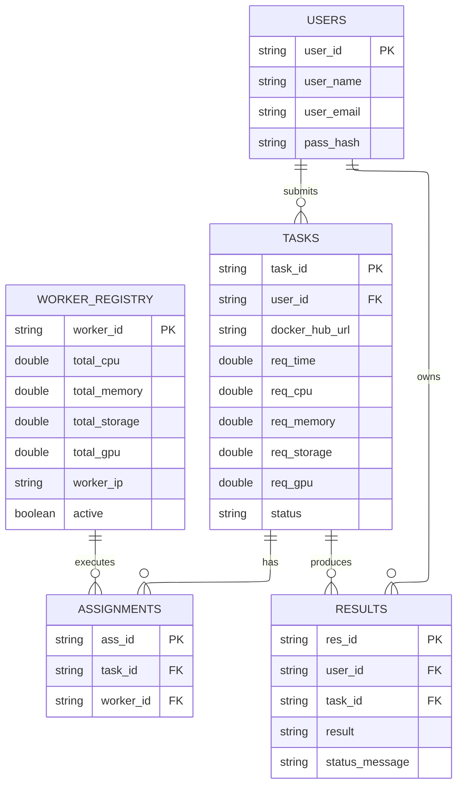

```mermaid
---
config:
  layout: elk
  look: classic
---
erDiagram
    USERS {
        string user_id PK
        string user_name
        string user_email
        string pass_hash
    }
    WORKER_REGISTRY {
        string worker_id PK
        double total_cpu
        double total_memory
        double total_storage
        double total_gpu
        string worker_ip
        boolean active
    }
    TASKS {
        string task_id PK
        string user_id FK
        string docker_hub_url
        double req_time
        double req_cpu
        double req_memory
        double req_storage
        double req_gpu
        string status
    }
    ASSIGNMENTS {
        string ass_id PK
        string task_id FK
        string worker_id FK
    }
    RESULTS {
        string res_id PK
        string user_id FK
        string task_id FK
        string result
        string status_message
    }
    USERS ||--o{ TASKS : "submits"
    USERS ||--o{ RESULTS : "owns"
    TASKS ||--o{ ASSIGNMENTS : "has"
    WORKER_REGISTRY ||--o{ ASSIGNMENTS : "executes"
    TASKS ||--o{ RESULTS : "produces"
```